# Engineering Portfolio Apps

## Summary

This repository contains three focused operational workflow apps. Each app is intentionally small, but the visible workflows are backed by local persistence, sample datasets, validation commands, and route smoke paths.

The goal is to show practical product engineering: state changes, records, constraints, review flows, and UI screens that behave consistently instead of static screens.

## Projects

| App | Domain | Stack | What it demonstrates |
| --- | --- | --- | --- |
| Booking Ops | Booking operations | Laravel / Inertia / React / SQLite | Customer intake, availability checks, blocked conflicts, persisted bookings, schedule visibility, and staff capacity context. |
| Commerce Sync Engine | Inventory/order sync workflow | Next.js / TypeScript / SQLite / Drizzle | Dry-run diffs, executable row plans, partial failure, retry, protected writes, records comparison, and operation logs. |
| Support RAG Console | Evidence-based support review | Next.js / TypeScript / SQLite / Drizzle | Source library, answer review, citation coverage, unsupported claims, review decisions, decision history, and evaluation results. |

## Preview

### Booking Ops

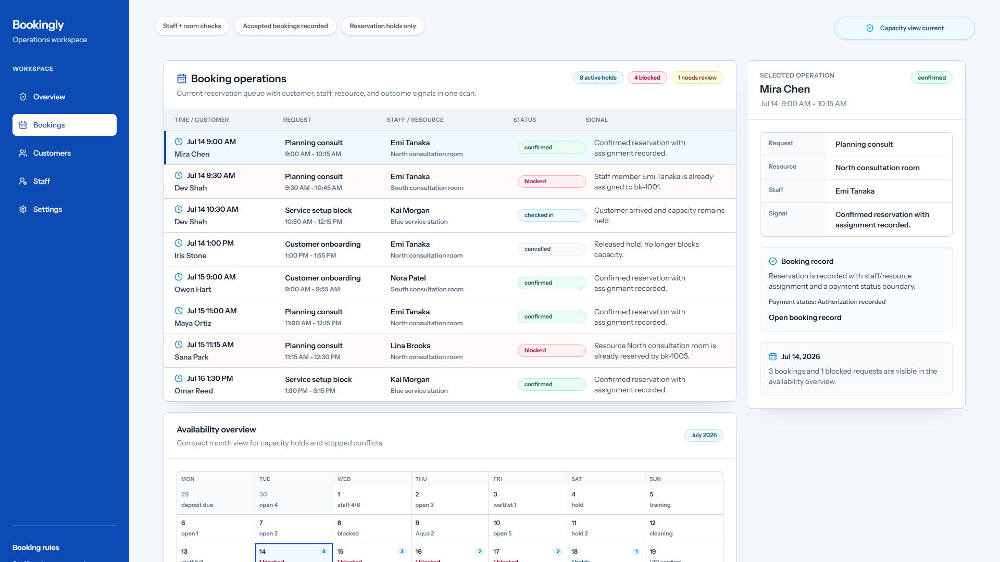

### Commerce Sync Engine

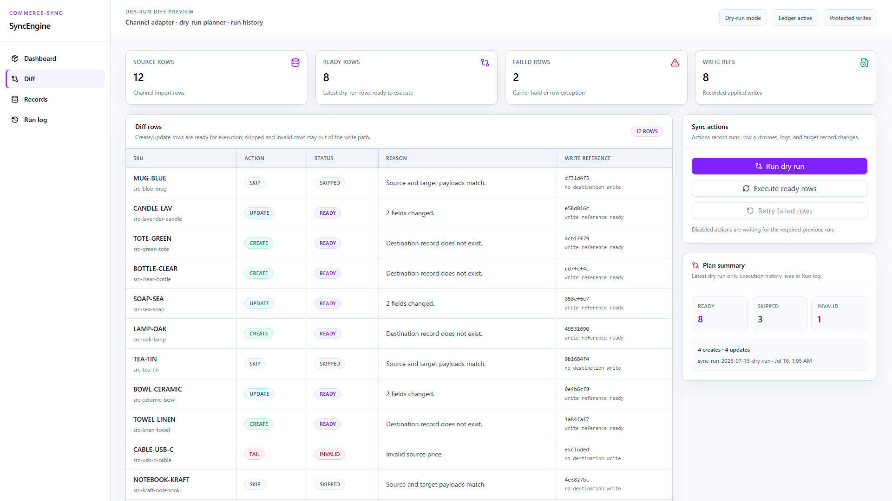

### Support RAG Console

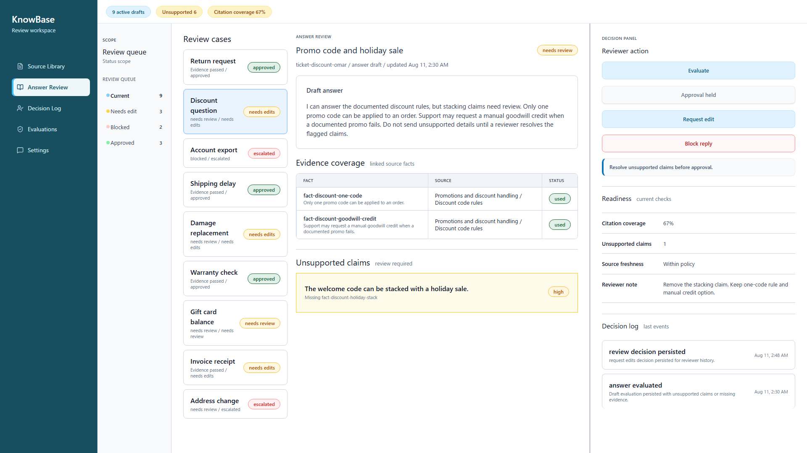

## Booking Ops

Booking Ops is a reservation operations workspace for reviewing availability, customer context, staff capacity, and booking outcomes.

### What it demonstrates

- Customer intake for the booking flow.
- Availability and capacity review before confirmation.
- Booking ledger with accepted, blocked, pending, and released-hold states.
- Monthly schedule persistence with selected-day booking details.
- Staff/resource conflict prevention.
- Customer and booking detail routes.
- Reservation hold and payment status boundary.

### More screenshots

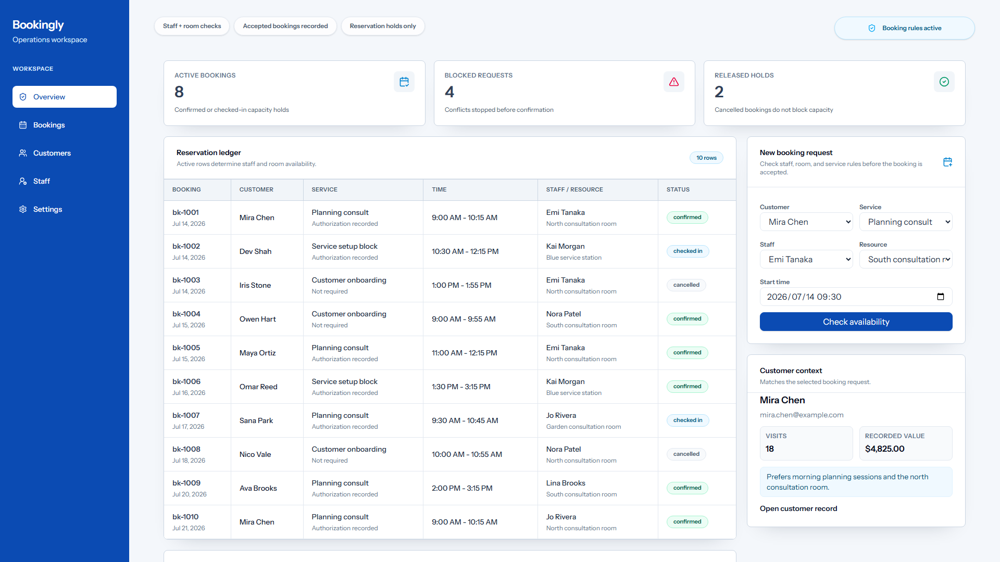
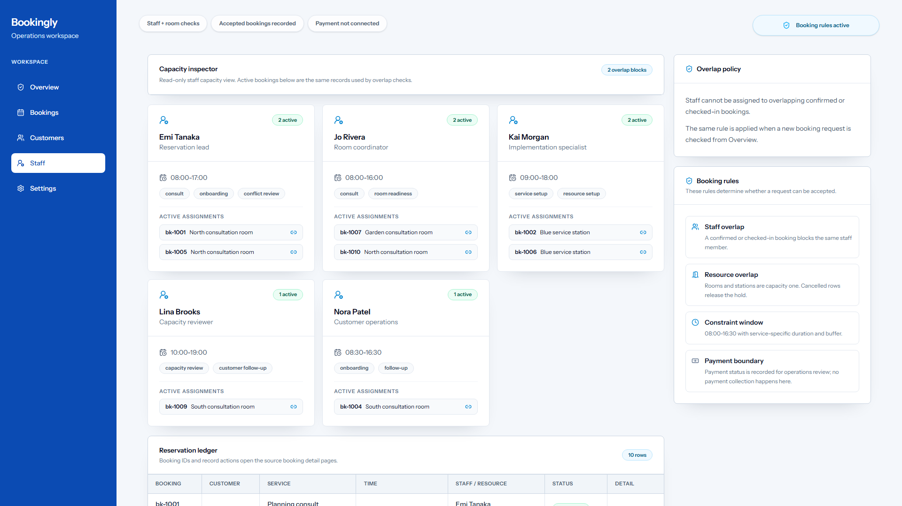
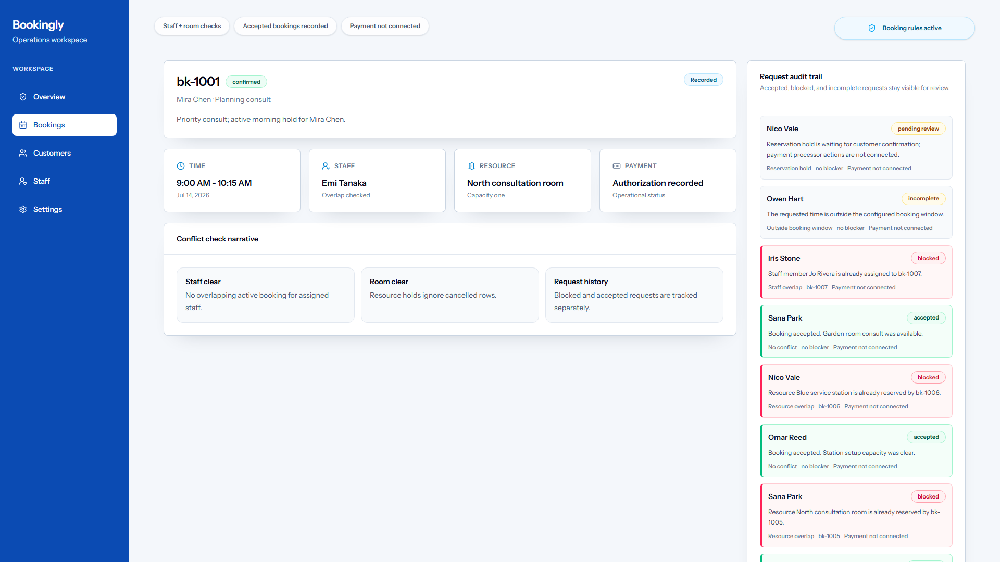

### Boundaries

- Real payment integration is intentionally out of scope.
- The app stores reservation hold and payment status metadata only.
- There is no Stripe, checkout, webhook, refund, or external payment API flow.
- Full CRM features such as customer edit, delete, merge, tags, and marketing history are out of scope.

### Validation

From the app directory:

```powershell
composer install
npm install
Copy-Item .env.example .env
php artisan key:generate
New-Item -ItemType File -Force database/database.sqlite | Out-Null
php artisan migrate:fresh --seed
composer test
npm run build
```

Route smoke after starting the Laravel server:

```txt
/
/schedule
/staff
/settings
/customers
/customers/new
/customers/cust-mira
/bookings/bk-1001
```

## Commerce Sync Engine

Commerce Sync Engine is a local sync console for reviewing proposed source-to-target changes, executing ready rows, retrying failed rows, and confirming protected writes.

### What it demonstrates

- Dry-run diff generation and row classification.
- Executable row plan with ready, skipped, invalid, and failed states.
- Execute-ready-rows workflow.
- Deterministic partial failure.
- Retry workflow for failed rows.
- Protected writes and duplicate-write prevention.
- Source records vs. target records comparison.
- Run history, run detail, and operation log visibility.

### More screenshots

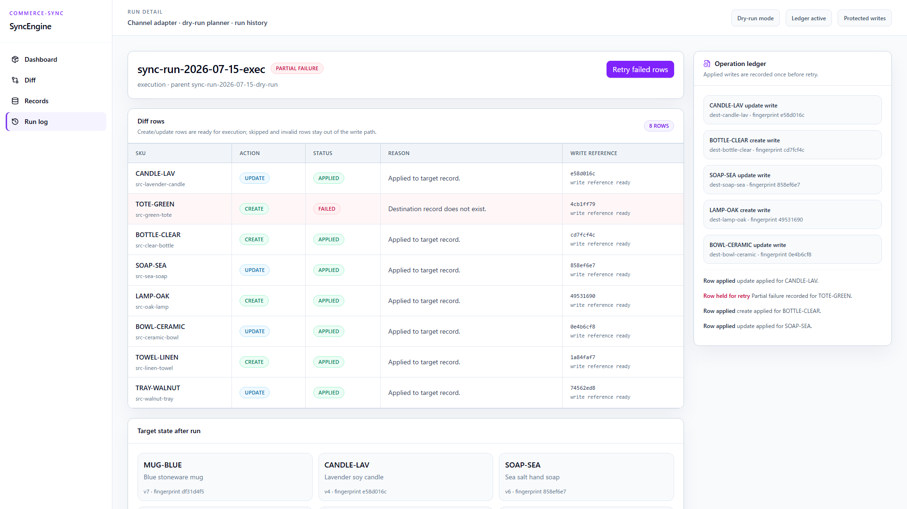
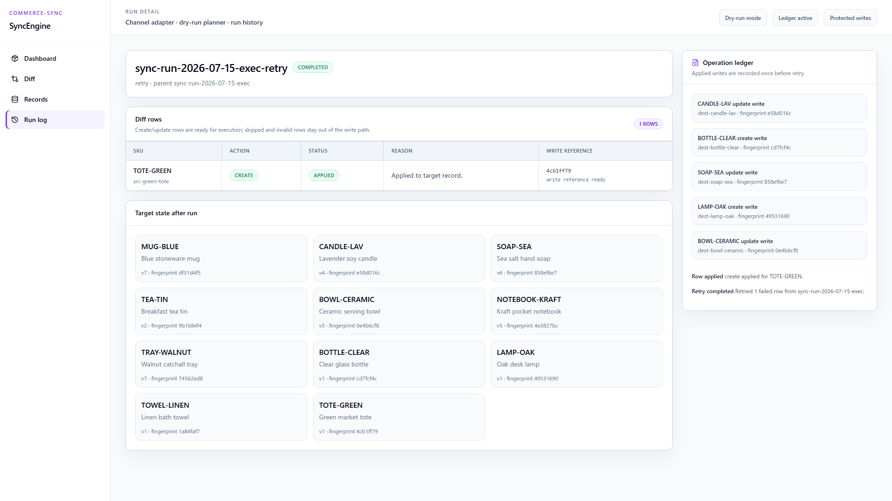
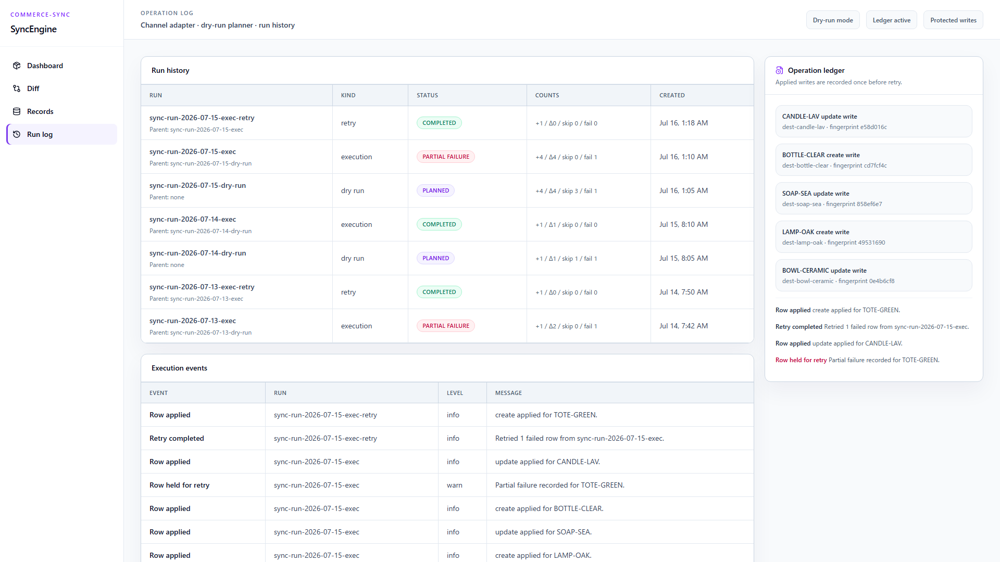

### Boundaries

- The sync workflow uses a local SQLite-backed simulation.
- External commerce APIs are intentionally out of scope.
- Webhooks, scheduled sync, background workers, production credentials, and provider integrations are out of scope.
- The sample dataset exists to make the local workflow reviewable.

### Validation

From the app directory:

```powershell
npm install
npm run db:reset
npm run typecheck
npm test
npm run build
```

Route smoke after starting the dev server:

```txt
/
/diff
/records
/log
/runs/sync-run-2026-07-15-exec
/runs/sync-run-2026-07-15-exec-retry
```

## Support RAG Console

Support RAG Console is a local evidence-review console for checking answer drafts against source material, citation coverage, unsupported claims, and reviewer decisions.

### What it demonstrates

- Source Library with knowledge sources, facts, usage, and evidence gaps.
- Answer Review with draft selection, citations, evidence coverage, unsupported claims, and reviewer actions.
- Decision Log with persisted review outcomes.
- Evaluations with coverage, unsupported claim counts, risk posture, and policy status.
- Ticket and answer detail routes.
- Deterministic sample-backed review workflow.

### More screenshots

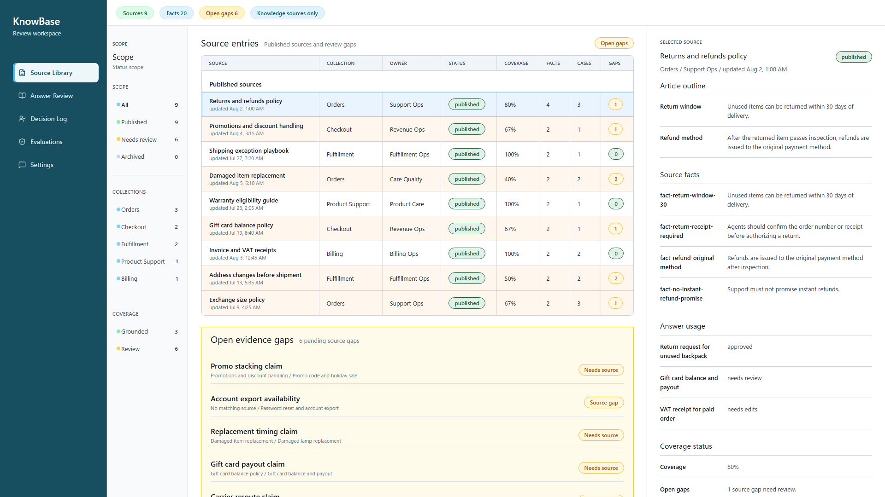
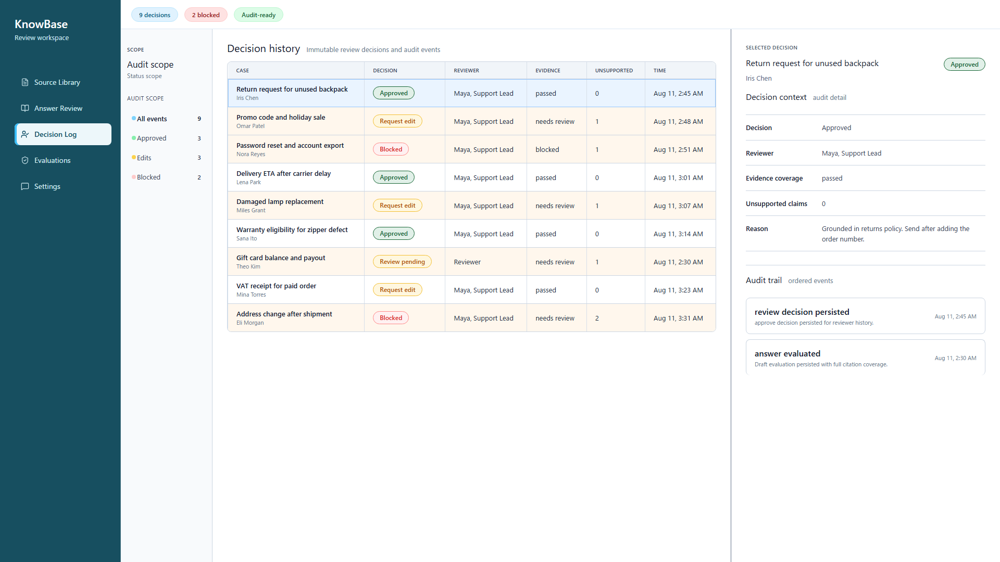
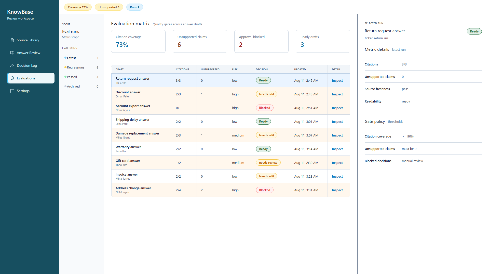

### Boundaries

- No real LLM or vector database is required for the demo.
- Citation and evidence behavior is backed by local sample data.
- Source upload, full knowledge-base CMS, live chat, autonomous replies, production inbox, auth, and email sending are out of scope.

### Validation

From the app directory:

```powershell
npm install
npm run db:reset
npm run typecheck
npm test
npm run build
```

Route smoke after starting the dev server:

```txt
/
/assistant
/review
/library
/evaluations
/settings
/tickets/ticket-return-iris
/tickets/ticket-account-nora
/answers/draft-ticket-return-iris
/answers/draft-ticket-discount-omar
/answers/draft-ticket-account-nora
```

## Tech Stack

- Laravel, Inertia, React, TypeScript, Tailwind CSS.
- Next.js, TypeScript, Drizzle ORM, Tailwind CSS.
- SQLite-backed local persistence and seed data.
- Feature tests, unit tests, type checks, builds, and route smoke checks.

## How to Run

Install and run each app from its app directory. Use the app-specific validation commands above before reviewing routes.

Suggested local ports:

| App | URL |
| --- | --- |
| Booking Ops | `http://127.0.0.1:4101` |
| Commerce Sync Engine | `http://127.0.0.1:4102` |
| Support RAG Console | `http://127.0.0.1:4103` |

## Validation Matrix

| App | Reset/Seed | Tests | Build | Smoke |
| --- | --- | --- | --- | --- |
| Booking Ops | `php artisan migrate:fresh --seed` | `composer test` | `npm run build` | Root, schedule, staff, settings, customers, customer detail, booking detail. |
| Commerce Sync Engine | `npm run db:reset` | `npm test` plus `npm run typecheck` | `npm run build` | Root, diff, records, log, execution run detail, retry run detail. |
| Support RAG Console | `npm run db:reset` | `npm test` plus `npm run typecheck` | `npm run build` | Root, source library, answer review, decision log, evaluations, settings, ticket detail, answer detail. |

## Design and Product Constraints

- Visible actions should be backed by local state, database records, or server-side workflows.
- External services are intentionally outside the scope of this portfolio package.
- Sample data is local and deterministic so reviewers can reset and inspect workflow states.
- The apps prioritize operational workflows over broad feature catalogs.

## Not Included

- Production deployment.
- Auth/RBAC.
- Real payment provider integration.
- External commerce APIs.
- Real LLM calls or vector database infrastructure.
- Production email delivery.
- Background workers and queue infrastructure.
- Full CRUD for every entity.

## License

MIT License.
